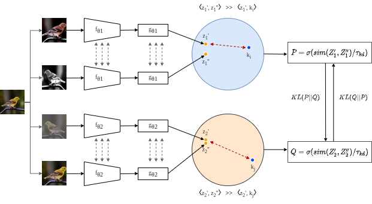

# Distill on the Go: Online knowledge distillation in self-supervised learning

This is the official repo for the CVPR 2021 L2ID paper ["Distill on the Go: Online knowledge distillation in 
self-supervised learning"](https://openaccess.thecvf.com/content/CVPR2021W/LLID/html/Bhat_Distill_on_the_Go_Online_Knowledge_Distillation_in_Self-Supervised_Learning_CVPRW_2021_paper.html)
By [Prashant bhat](https://scholar.google.com/citations?view_op=list_works&hl=en&user=jrEETfgAAAAJ),
[Elahe Arani](https://www.researchgate.net/profile/Elahe-Arani), 
and [Bahram Zonooz](https://scholar.google.com/citations?hl=en&user=FZmIlY8AAAAJ)

#### Abstract: 
Self-supervised learning solves pretext prediction tasks that do not require annotations to learn feature representations.
For vision tasks, pretext tasks such as predicting rotation, solving jigsaw are solely created from the input data. Yet, 
predicting this known information helps in learning representations useful for downstream tasks. However, recent works
have shown that wider and deeper models benefit more from self-supervised learning than smaller models. To address the 
issue of self-supervised pre-training of smaller models, we propose Distill-on-the-Go (DoGo), a self-supervised learning 
paradigm using single-stage online knowledge distillation to improve the representation quality of the smaller models. 
We employ deep mutual learning strategy in which two models collaboratively learn from each other to improve one another. 
Specifically, each model is trained using self-supervised learning along with distillation that aligns each model's 
softmax probabilities of similarity scores with that of the peer model. We conduct extensive experiments on multiple 
benchmark datasets, learning objectives, and architectures to demonstrate the potential of our proposed method. 
Our results show significant performance gain in the presence of noisy and limited labels and generalization to 
out-of-distribution data.

For details, please see the
[Paper](https://openaccess.thecvf.com/content/CVPR2021W/LLID/html/Bhat_Distill_on_the_Go_Online_Knowledge_Distillation_in_Self-Supervised_Learning_CVPRW_2021_paper.html)
and [Presentation](https://www.youtube.com/watch?v=Sfs5ya2vEyg&ab_channel=NeurAI) 

#### Requirements: 
* Python 3.7 
* PyTorch 1.4.0
* Torchvision 0.5.0

#### Model checkpoints: 

#### How to Run:
To run our method: 
<pre> python train.py --config-file  config/template.yaml </pre>

#### Cite our work:
<pre>
@inproceedings{bhat2021distill,
  title={Distill on the Go: Online knowledge distillation in self-supervised learning},
  author={Bhat, Prashant and Arani, Elahe and Zonooz, Bahram},
  booktitle={Proceedings of the IEEE/CVF Conference on Computer Vision and Pattern Recognition},
  pages={2678-2687},
  year={2021}
}
</pre>

#### License
This project is licensed under the terms of the MIT license.